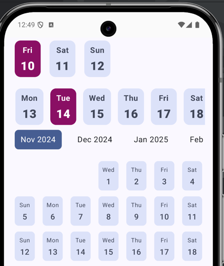
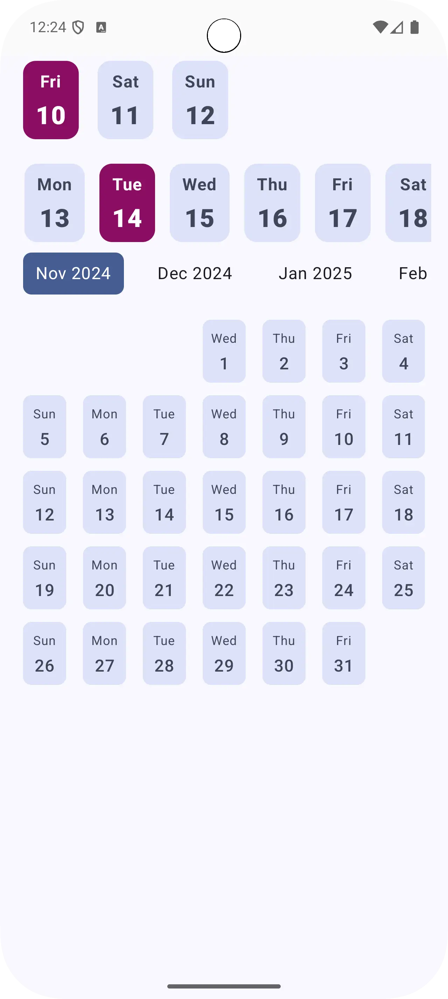

# XCalendar [](https://jitpack.io/#TuleSimon/XCalendar)
<p> 
  
</p>

## 💡 Description

XCalendar is a Androidlibrary designed to offer a straightforward and user-friendly
scrollable horizontal calendar component for both Android applications, it also provides a Linear Grid Calendar Version also.


## 📸 Screenshots
<p>
  

</p>


## ⚙️ Setup
To integrate XCalendar into your project, add the following dependencies to the gradle file of your application

```kotlin
dependencyResolutionManagement {
    repositoriesMode.set(RepositoriesMode.FAIL_ON_PROJECT_REPOS)
    repositories {
        google()
        mavenCentral()
        // Add GitHub Packages repository
        maven {
            name = "GitHubPackages"
            url = uri("https://maven.pkg.github.com/tulesimon/XCalendar")
            credentials {
                // Ensure your GitHub token (gpr.token) and user (gpr.user) are set
                username = project.findProperty("gpr.user") as? String ?: System.getenv("GITHUB_ACTOR")
                password = project.findProperty("gpr.token") as? String ?: System.getenv("GITHUB_TOKEN")
            }
        }
    }
}
```

or if using jitpack
```kotlin
dependencyResolutionManagement {
    repositoriesMode.set(RepositoriesMode.FAIL_ON_PROJECT_REPOS)
    repositories {
        mavenCentral()
        maven { url 'https://jitpack.io' }
    }
}
```

## 2. Add Dependency

In your module-level build.gradle.kts:
```kotlin
dependencies {
// Core calendar component
implementation("com.anonymous:xlinearcalendar:1.0.0")

    // If using JitPack
    implementation("com.github.TuleSimon:XCalendar:1.0")
}
```


**Note**: XCalendar utilizes the `kotlinx-datetime` library, you don't have to include this, as we only expose the java `Date`.


## 📱 Usage
### Basic usage
XCalendar provides a basic implementation of a date cell that can be used to display a simple row calendar.   
The following code snippet shows how to use the different available options

### 1. XLinearCalendar (Horizontal Date Scroll)

This component is ideal for displaying a compact, continuously scrolling list of days or for a date picker.
```kotlin
val customDates = listOf( /* ... list of Date objects ... */ )

XLinearCalendar(
    modifier = Modifier.height(100.dp), // Optional: limit the height
    initialDates = customDates,         // Optional: pre-select initial dates
    content = { date, isSelected, onClick ->
        DateCell(
            date = date,
            isSelected = isSelected,
            onDateSelected = onClick,
            modifier = Modifier.padding(6.dp)
        )
    }
)

```   

Bounded Calendar Example

You can limit the date range (e.g., for a booking system):
```kotlin
@Composable
fun BoundedCalendarExample() {
    XLinearCalendar(
        isBounded = true,
        maxDays = 90, // Only display the next 90 days from the start date
        shouldLoadNext = false,
        shouldLoadPrevious = false,
        state = rememberXLinearCalendarState(instanceName = "BookingInstance"),
        content = { date, isSelected, onClick ->
            DateCell(
                date = date,
                isSelected = isSelected,
                onDateSelected = onClick
            )
        }
    )
}

```


### 2. XLinearGridCalendar (Monthly Grid View)

This component displays a full monthly grid and allows horizontal scrolling between months, fully customizable through two content lambdas.

```kotlin
XLinearGridCalendar(
    shouldLoadNext = true,
    shouldLoadPrevious = true,
    monthContent = { monthDate, isSelected, onClick ->
        DefaultGridMonthCell(
            month = monthDate,
            isSelected = isSelected,
            onMonthSelected = onClick,
            modifier = Modifier.padding(6.dp)
        )
    },
    dayContent = { dayDate, isSelected, onClick ->
        DefaultGridDayCell(
            date = dayDate,
            isSelected = isSelected,
            onDateSelected = onClick,
            modifier = Modifier.padding(6.dp)
        )
    }
)

```


## 🛠️ API & Customization

The power of this library comes from the composable lambda arguments, which allow you to inject your own UI for different parts of the calendar.

| Component | Lambda Parameter | Description |
|:---|:---|:---|
| XLinearCalendar | `content` | Renders the individual date cell in the horizontal list. |
| XLinearGridCalendar | `monthContent` | Renders the header (the month title) in the grid view. |
| XLinearGridCalendar | `dayContent` | Renders each day cell in the monthly grid. Date? is null for filler days. |

---

# Full Example 
```kotlin
class MainActivity : ComponentActivity() {
    override fun onCreate(savedInstanceState: Bundle?) {
        super.onCreate(savedInstanceState)
        enableEdgeToEdge()
        setContent {
            XLinearCalendarTheme {
                Scaffold(
                    modifier = Modifier
                        .fillMaxSize()
                        .statusBarsPadding()
                ) { innerPadding ->
                    Sample()
                }
            }
        }
    }
}

@Composable
fun Sample() {
    val customDates = listOf(
        Date(2025 - 1900, 9, 10), // Oct 10, 2025
        Date(2025 - 1900, 9, 11),
        Date(2025 - 1900, 9, 12)
    )
    Column(Modifier.padding(horizontal = 16.dp)) {
        XLinearCalendar(
            modifier = Modifier.height(100.dp),
            initialDates = customDates,
            shouldLoadNext = false,
            shouldLoadPrevious = false,
            content = { date, isSelected, onClick ->
                DateCell(
                    date = date,
                    colors = DateCellDefaults.colors().copy(
                        selectedContainerColor = selected,
                        selectedTextColor = Color.White
                    ),
                    isSelected = isSelected,
                    onDateSelected = onClick,
                    modifier = Modifier.padding(6.dp)
                )

            }
        )
        BoundedCalendarExample()
        XLinearGridCalendar(
            modifier = Modifier,
            shouldLoadNext = true,
            shouldLoadPrevious = true,
            monthContent = { date, isSelected, onClick ->
                DefaultGridMonthCell(
                    month = date,
                    isSelected = isSelected,
                    onMonthSelected = onClick,
                    modifier = Modifier.padding(6.dp)
                )
            },
            dayContent = { date, isSelected, onClick ->
                DefaultGridDayCell(
                    date = date,
                    isSelected = isSelected,
                    colors = DateCellDefaults.colors().copy(
                        selectedContainerColor = selected,
                        selectedTextColor = Color.White
                    ),
                    onDateSelected = onClick,
                    modifier = Modifier.padding(6.dp)
                )
            },
        )
    }
}

/** 4. Bounded Calendar with Limits */
@Composable
fun BoundedCalendarExample() {
    XLinearCalendar(
        isBounded = true,
        maxDays = 90,
        shouldLoadNext = false,
        shouldLoadPrevious = false,
        state = rememberXLinearCalendarState(instanceName = "NewInstance"),
        content = { date, isSelected, onClick ->
            DateCell(
                date = date,
                colors = DateCellDefaults.colors().copy(
                    selectedContainerColor = selected,
                    selectedTextColor = Color.White
                ),
                isSelected = isSelected,
                onDateSelected = onClick,
                modifier = Modifier.padding(4.dp)
            )
        }
    )
}
```

## State Information

```markdown
| Component | Lambda Parameter | Description |
|:---|:---|:---|
| XLinearCalendar | `content` | Renders the individual date cell in the horizontal list. |
| XLinearGridCalendar | `monthContent` | Renders the header (the month title) in the grid view. |
| XLinearGridCalendar | `dayContent` | Renders each day cell in the monthly grid. Date? is null for filler days. |

---

## State Information

| Key | Value | Description |
|:---|:---|:---|
| **State Name** | `state: XLinearCalendarState` | Required for programmatic control and state persistence (see `rememberXLinearCalendarState`). |
```

## 🤝 Contribution

If you wish to contribute, please feel free to submit pull requests or issues to help improve RowKalendar.

## 💙 Find this repository useful?
If you find this library useful, please consider starring the repository and sharing it with others :star:

# License
```xml
Licensed under the Apache License, Version 2.0 (the "License");
    you may not use this file except in compliance with the License.
    You may obtain a copy of the License at

    http://www.apache.org/licenses/LICENSE-2.0

    Unless required by applicable law or agreed to in writing, software
    distributed under the License is distributed on an "AS IS" BASIS,
    WITHOUT WARRANTIES OR CONDITIONS OF ANY KIND, either express or implied.
    See the License for the specific language governing permissions and
    limitations under the License.
```
